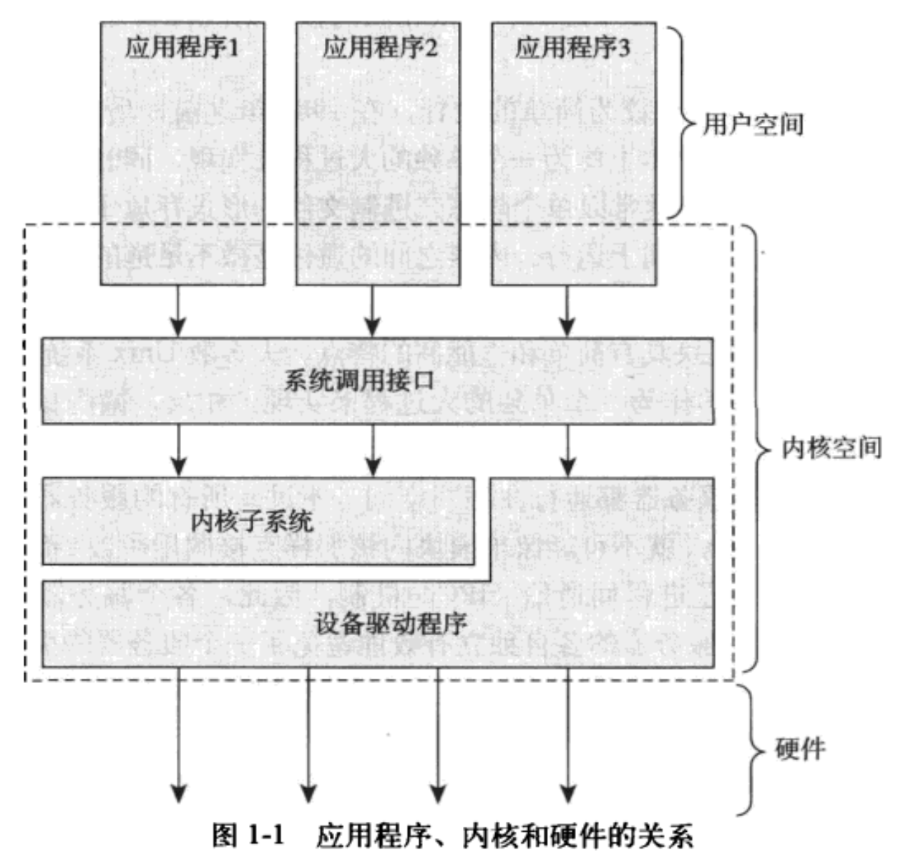
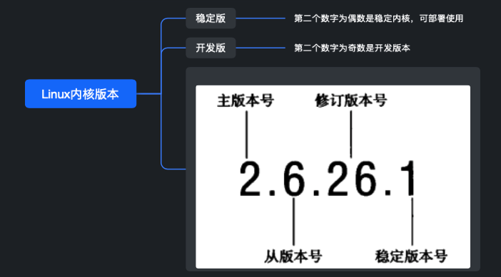

<h1 align="center">📔 第 01 章 Linux内核简介 学习笔记</h1>

## 1. Unix的历史

几个时间点：

- Unix从贝尔实验室诞生，基于早期的Multics（多用户OS）开发。

- 由 Dennis Ritchie 和 Ken Thompson 在1969年在PDP-7型机上实现了OS，并在1971年移植到PDP-11型机上。

- 1993年，使用C语言重写了Unix 操作系统。并在后续出现了变体。

- 1977年，贝尔实验室推出变体Unix System III 版本

- 1983年， AT&T 推出 System V。

- 1977年，加州伯克利大学基于Unix推出的变体 Berkeley Software Distribution（BSD）。并在后续的版本中，迭代了很多新的特性。

Unix强大的几个特点：

- Unix简洁
- 所有的东西都被当作文件对待。
- Unix的内核和相关的系统工具软件都是C语言编写而成。
- Unix进程创建迅速
- Unix提供了简单但有稳定的进程间通信机制。

目前，Unix已发展成为一个支持抢占式多任务、多线程、虚拟内存、换页、动态链接和TCP/IP网络的现代化操作系统。

## 2. Linux概述
- 由于Microsoft DOS系统（只能游戏） 和 Minix系统（教学系统）的局限性，所以出现了Linux系统。

    - 1991年，Linus Torvalds 使用 Intel 80386 微处理器开发了新的OS --- Linux。

- 到目前，Linux已被广泛移植到Alpha、ARM、PowerPC、SPARC、x86-64等诸多体系结构上。也安装在最小的电子设备上。

- Linux是类Unix系统，但不是Unix。
    - 借鉴Unix的设计和API，Linux一定程度上会兼容Unix的API，并且保证了应用程序编程接口的一致性。

- Linux是一个非商业化产品，Linux内核是自由（公开）软件，但不是无限自由。使用GPL协议。

    - GPL协议：可以自由地获取内核代码并修改它，发布后，也要公开相应的全部源代码。

- Linux用途广泛。Linux系统的基础是内核、C库、工具集和系统的基本工具。

## 3. 操作系统和内核概述
操作系统是指在整个系统中负责完成最基本功能和系统管理的部分：内核、设备驱动程序、启动引导程序、命令行Shell或其它种类的用户界面、基本的文件管理工具和系统工具。

用户界面是OS的外在表象，内核是OS的内在核心。

内核主要工作

- 负责响应中断的中断服务程序
- 负责管理多个进程而分享处理器时间的调度程序
- 负责管理进程地址空间的内存管理程序和网络
- 进程间的通信等系统服务等。

系统态和被保护起来的内存空间，称为内核空间。

- 在系统中运行的应用程序通过系统调用来与内核进行通信。
    - 交互方式：

        - 应用程序通常调用库函数再由库函数通过系统调用界面，让内核代其完成不同的任务。

    - 应用程序被称为通过系统调用在内核空间运行，内核被称为运行于进程上下文中。

- 内核也负责管理系统的硬件设备。
    - 所有体系结构，都提供了中断机制。

    - 当硬件设备想与系统通信时，首先要发出一个异步的中断信号去打断处理器的执行，继而打断内核的执行。
    - 中断通常对应一个中断号，内核通过中断号查找相应的中断服务程序，并调用程序响应和处理中断。

对于上下文代表着内核活动的范围。应用程序、内核和硬件的关系如下：

- 运行于用户空间，执行用户进程
- 运行于内核空间，处于进程上下文，代表某个特定的进程执行。
- 运行于内核空间，处于中断上下文，与任何进程无关，处理某个特定的中断。

## 4. Linux内核和传统Unix内核的比较
- 所有的Unix内核都同宗同源，都提供了相同的API。内核必须单独的可执行块的方式在一个单独的地址空间中运行。

- Unix内核通常需要硬件系统提供页机制（MMU）以管理内存，从而加强对内存空间的保护，保证每个进程都可以运行于不同的虚拟地址空间上。

对于OS内核，主要分为两种：

- 单内核
- 微内核
- 外内核（主要用在科研系统）

单内核与微内核设计的比较

- 单内核：把它从整体上作为单独的大过程来实现，同时也运行在一个单独的地址空间上。
    - 以单个静态二进制文件的形式存放于磁盘中
    - 内核的通信都运行在内核态，并处于同一地址空间：内核可以直接调用函数。

- 微内核：功能划分为多个独立的过程，每个过程叫做一个服务器。
    - 如果没有特权模式，其它都运行在用户空间中。
    - 所有的过程都保持独立并运行在各自的地址空间中。
    - 通过消息传递方式处理微内核通信：采用进程间通信机制。
    - 模块化的设计允许一个过程为了另一个过程而换出。

IPC机制的开销多于函数调用，也就涉及到内核空间和用户空间的上下文切换，消息传递需要一定的周期。

Linux是模块化、多线程以及内核本身可调度的操作系统。Linux内核与传统的Unix系统之间的差异：

- Linux支持动态加载内核模块
- Linux支持对称多处理（SMP）机制，Unix变体也支持，但传统的Unix不支持。
- Linux内核可以抢占。除了Solaris 和 IRIX支持，其它大多数Unix不支持。
- Linux内核不区分线程和进程。对内核来说，所有的进程一样。
- Linux提供具有设备类的面向对象的设备模型、热插拔时间、以及用户空间的设备文件系统（sysfs）
- Linux支持多特性发展，摒弃了Unix的很多特性。

尽管Linux和Unix存在很大的差异，但是Linux很大程度上也兼容了Unix的特性。

## 5. Linux内核版本

