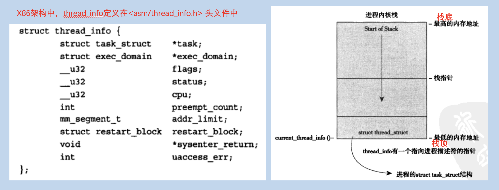
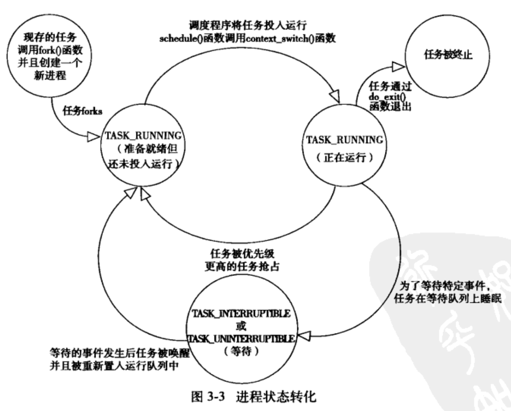

<h1 align="center">📔 第 03 章 进程管理 学习笔记</h1>


## 1. 进程概述
- 进程是处于执行期的程序（目标码存放在某种存储介质上）。
    - 进程是正在执行的程序代码的实时结果。

- 执行线程，简称线程，是在进程中活动的对象。
    - 每个线程都有独立的程序计数器、进程栈和一组进程寄存器。

    - 在Linux中，线程是一种特殊的进程。

- 现代OS中，进程提供了两种虚拟机制：

    - 虚拟处理器：多个进程共享一个处理器，虚拟处理器就是给进程一种独享处理器的错觉。
    - 虚拟内存：让进程在分配和管理内存时觉得自己独享整个系统的所有内存资源。

    - 在线程之间可以共享虚拟内存，但每个线程都有各自的虚拟处理器。

- 程序本身不是进程，进程是处于执行期的程序以及相关的资源的总称。

- Linux 内核中把进程叫做任务。

## 2. 进程描述符及任务结构
内核把进程的信息列表存放在任务队列（task list）的双向链表中。链表中的每一项都是类型为 `task_struct`，称为进程描述符的结构。
- 结构定义在 `<linux/sched.h>` 头文件中。

进程描述符中包含一个具体进程的所有的信息。包含了：打开的文件、进程的地址空间、挂起的信号，进程的状态等信息。


### 2.1 分配进程描述符
Linux通过slab分配器分配 `task_struct` 结构，从而达到对象复用和着色的目的。




### 2.2 进程描述符的存放
内核通过唯一的 `进程标识值或者PID` 来标识每个进程。内核将每个进程的PID存放到各自的进程描述符中。

- IPD是一个int类型的数，标识 pid_t 隐含类型。
- PID最大值默认为32768（可以在 `<linux/threads,h>` 头文件中修改限制值）。

在内核中，访问任务通常需要获得指向其 `task_struct` 的指针。硬件体系结构的不同，访问和查找 `task_struct` 结构的方式也不同。

### 2.3 进程状态
系统中的每个进程都必然处于五种状态中的其中一种。




### 2.4 设置当前进程状态
内核进程需要调整某个进程的状态。所以使用 `set_task_state(task, state)` 函数：

```c
set_task_state(task, state); // 将指定的进程task设置为指定的状态state
```

具体的参数查看 <linux/sched.h> 头文件。

### 2.5 进程上下文
可执行程序代码从一个可执行文件载入到进程的地址空间执行。

- 一般程序在用户空间执行。

- 程序执行了系统调用或者异常处理，此时陷入内核执行，这种方式称内核为 “代表进程执行” 并处于进程上下文中。

    - 对于某些接口，内核有明确的定义，程序对内核的访问都必须通过这些接口。

### 2.6 进程家族树
- 在Linux/Unix中，进程之间存在继承关系。Linux中所有的进程都是PID为1的init进程的后代。内核在系统启动的最后阶段启动init进程。

- 系统中每个进程必有一个父进程，每个进程也可以有零个或多个子进程。拥有同一个父进程的所有进程叫兄弟。

- init进程的进程描述符是 `init_task` 静态分配的。


- 对于进程来说，可以通过重复遍历的方式查找指定的进程：
    - 缺点：遍历会造成大量的开销。

- 获取给定的进程的方式：

    ```c
    list_entry(task->tasks.next, struct task_struct, tasks); // 获取链表中的下一个进程
    list_entry(task->tasks.prev, struct task_struct, tasks); // 获取链表中的前一个进程
    ```

## 3. 进程创建
Linux创建进程的方式和其它系统不同，在Linux中创建进程的步骤是两个单独的函数：

- `fork()`：拷贝当前进程创建一个子进程。
- `exec()`：负责读取可执行并将其载入到地址空间开始运行。

### 3.1 写时拷贝
- Linux的 `fork()` 使`写时拷贝（copy-on-write）页`实现。

    > 写时拷贝是一种可以推迟甚至免除拷贝数据的计数。

- 内核并不是复制整个进程地址空间，而是让父进程和子进程共享同一个拷贝。只有在需要写入时，数据才会被复制，使得各个进程拥有各自的拷贝。

- `fork()` 的开销时复制父进程的页表以及给子进程创建唯一的进程描述符。


### 3.2 `fork()`
Linux中的 `fork()` 的实现是通过系统调用 `clone()` ，然后`clone()`再去调用 `do_fork()`。而 `do_fork()` 函数调用了 `copy_process()` 函数去让进程运行。函数定义在 `kernel/fork.c` 文件中。

`copy_process()` 函数的执行过程：

- 调用 `dup_task_struct()` 为新进程创建一个`内核栈、thread_info` 结构和 `task_struct`，其中的值和当前父进程的值相同。

- 检查并确保新创建的子进程的数目没有超过所分配的资源的限制。

- 设置子进程的信息`清0或者设置为初始值`。使其父子进程区分开。

- 将新创建的子进程的状态设置为 `TASK_UNINTERRUPTIBLE`，保证不会被投入运行。

- `copy_process()` 调用 `copy_flags()` 以更新 t`ask_struct` 的`flags`成员。
    - 表明进程是否拥有`超级用户权限`的 `PF_SUPERPRIV` 标志被`清0`
    - 表明进程还`没有调用 exec()` 函数的 `PF_FORKNOEXEC` 标志被设置。

- 调用 `alloc_pid()` 为新进程`分配`一个`有效的PID`

- 根据`clone()` 的参数标识， `copy_process()` 拷贝或共享打开的文件、文件系统信息、信号处理函数、进程地址空间和命名空间等。

- `copy_process()` 做扫尾工作并返回一个指向子进程的指针。

### 3.3 `vfork()`
- 除了`不拷贝父进程的页表项`外，`vfork()` 和 `fork()` 的功能相同。


## 4. 线程在Linux中的实现
线程机制的好处

- 提供了在同一程序内共享内存地址空间运行的一组线程。
- 支持并发程序设计。
- 在多处理系统中，也能保证真正的并行处理。

Linux中，线程也称为轻量级的进程。线程被抽象成一种耗费较少资源，执行迅速的执行单元。

### 4.1 创建线程
线程的创建和进程的创建类似，只需要在调用 clone() 时传递一些参数标志来指明需要共享的资源：

```c
// 和fork() 操作类似，父子进程共享地址空间、文件系统资源、文件描述符和信号处理程序
clone(CLONE_VM | CLONE_FS | CLONE_FILES | CLONE_SIGHAND, 0);

// 普通fork() 的实现
clone(SIGCHLD, 0);

// vfork() 的实现
clone(CLONE_VFORK | CLONE_VM | SIGCHLD, 0);
```

不同的参数决定了父子进程间共享的资源种类。

### 4.2 内核线程
内核线程和普通进程间的区别：

- 内核线程没有独立的地址空间（指向地址空间的mm指针被设置为NULL），只能在内核空间中运行。

- 都可以被调度，也可以被抢占。


## 5. 进程终止
当一个进程终止时，内核必须释放所占的资源并告知其父进程。

进程的创建是`fork()`，终止时是`exit()`系统调用。当进程接收到既不能处理也不能忽略的信号或者异常是，就会被动触发终止。大部分终止都要 do_exit() 来完成。也就有对应的步骤：

- 将 `task_struct` 中的标志成员设置为 `PF_EXITING`。
- 调用 `del_timer_sync()` 删除一内核定时器。根据返回结果，判断定时器是否在排队或者在运行。

- 调用 `exit_mm()` 函数释放进程占用的 `mm_struct`，如果未被占用，就彻底释放。

- 调用 `sem__exit()` 函数，使进程离开排队等候IPC信号。

- 调用 `exit_files()` 和 `exit_fs()`，以分别递减文件描述符、文件系统数据的引用计数。

- 把 `task_struct` 的 `exit_code` 成员中的任务退出代码置为由 `exit()` 提供的退出代码。

- 调用 `exit_notify()` 向父进程发送信号，给子进程重新找父进程。并将进程状态设置为 `EXIT_ZOMBIE`。

- `do_exit()` 调用 `schedule()` 切换到新的进程继续指向。
    - `do_exit()` 没有返回值。

子进程处于 EXIT_ZOMBIE 状态时，进程不会被调度，与进程相关联的资源都被释放了，但是被占用的内存没有被释放。例如：创建进程时分配的内核栈、thread_info结构和task_struct结构等，都需要父进程释放。


### 5.1 删除进程描述符
执行 `do_exit()` 之后，会残留对应进程的进程描述符。


父进程在收到 `exit_notify()` 告知后，检测信息的状态。如果未被占用，就直接释放所有内存，归还给系统使用。

当需要释放进程描述符时，调用 `release_task()` 完成如下工作：

- 调用 `__exit_signal()`，该函数调用 `_unhash_process()` ，而`_unhash_process()` 再去调用 `detach_pid()` 从 `pidhash` 上删除该进程，同时从任务列表中删除进程。

- `_exit_signal()` 释放目前僵死进程所使用的所有剩余资源，并进行最终统计和记录。

- 如果出现领头进程死掉，`release_task()` 需要告知僵死的领头进程的父进程。

- `release_task()` 调用 `put_task_struct()` 释放进程内核栈和 `pthread_info` 结构所占的页，并释放 `task_struct` 所占的slab高速缓存。

### 5.2 孤儿进程造成的进退维谷
- 如果父进程在子进程之前退出，会给子进程在当前线程组内找一个线程作为父进程，如果不行，就用`init`作为父进程。

- 当子进程在退出时，`do_exit()` 会调用`exit_notify()`，则notify函数会调用 `forget_original_parent()`，而后者会调用 `find_new_reaper()` 来执行寻找父进程。
    - `find_new_reaper()` 先在当前进程组中找一个线程作为父进程，如果找不到，就使用 init 作为父进程。
    - init 进程在Linux启动时就一直会存在。
