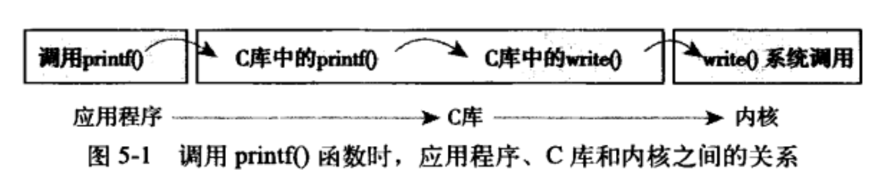

<h1 align="center">📔 第 05 章 系统调用 学习笔记</h1>


## 1. 与内核通信
在现代OS中，内核提供了几种能力：

- 提供了用户进程和内核进行交互的接口，通过接口受限地访问硬件设备。
- 提供了创建新进程并与已有进程进行通信的机制。
- 提供了申请OS其它资源的能力。


系统调用在用户空间进程和硬件设备之间添加了一个中间层，类似于两者沟通的桥梁。作用：

- 为用户空间提供了一种硬件的抽象接口。
- 系统调用保证了系统的稳定和安全
- 在用户空间和其它系统中提供了一层公共接口。

Linux中，系统调用是除异常和陷入外，用户空间访问内核唯一的合法入口。

## 2. API、POSIX和C库
一般情况下，应用程序通过在用户空间实现的应用编程接口（API）而不是直接通过系统调用来编程。

POSIX、API、C库以及系统调用之间的关系：



Unix中，应用编程接口是基于POSIX标准。Linux系统调用作为C库的形式提供。C库主要提供了包括标准C库函数和系统调用接口的API。

## 3. 系统调用

`访问系统调用（Linux中syscall）`通过C库中定义的函数调用来进行。系统调用出现错误时，C库会把错误码写入到 `errno全局变量` 中。通过调用 `perror()` 库函数，就会打印用户可理解的错误字符串提示。

asmlinkage限定词，是一个编译指令，通知编译器仅从栈中提取该函数的参数。


### 3.1 系统调用号
Linux的系统调用都有一个独一无二的系统调用号，通过此号关联系统调用，主要是指明执行哪个系统调用。

- 系统调用号分配后，不能有任何变更，否则会导致应用程序崩溃。
- 如果系统调用被删除，则所占的调用号也不允许回收利用，否则以前的代码会使用。
    - 填补空缺的方法：`sys_ni_syscall()` 函数专门针对系统调用被删除或者变得不可用时使用。

内核记录了系统调用表中的所有已注册过的系统调用的`列表（sys_call_table）`，这个表为每个有效的系统调用指定了唯一的系统调用号。

## 4. 系统调用处理程序
用户空间的程序无法直接执行内核代码。

- 应用程序以某种方式通知系统，告知内核要执行某一个系统调用并切换到内核态。
    - 告知内核的机制通过软中断实现：通过引发一个异常来促进系统切换到内核态去执行异常处理程序。


### 4.1 指定恰当的系统调用
- `system_call()` 函数通过将给定的系统调用号与 `NR_syscalls` 做比较来检查有效性。
    - 如果大于等于 `NR_syscalls`，函数返回 `-ENOSYS`。否则直接执行系统调用。

- 系统调用表中的表项是以`64位（8字节）类型`存放，所以内核需要将给定的系统调用号`乘以4`，通过所得的结果在表中查询其位置。

### 4.2 参数传递
除了系统调用号外，其它系统调用也需要一些外部的参数输入。在发生陷入时，把参数从用户空间传入到内核中。

在x86系统中，一般将前5个参数存放在寄存器`ebx,ecx,edx,esi和edi`中，如果参数过多，就用一个单独的寄存器存放指向参数在用户空间地址的指针。


- 给用户空间的返回值也通过寄存器传递。

## 5. 系统调用的实现

Linux系统调用在实现时无需更新它和系统调用处理程序之间的关系。

### 5.1 实现系统调用
实现一个新的Linux系统调用所需的步骤：

- 决定接口的系统调用的一个明确的用途。要做什么和不应该做什么？
- 要为将来考虑，是否对函数做了不必要的限制？
- 注意可移植性和健壮性。


### 5.2 参数验证
系统调用必须仔细检查它所有的参数是否合法有效。

- 如果参数不合法，会导致系统存在安全隐患。

主要关注几种检查：

- 检查用户提供的指针是否有效。
- 检查是否有合法权限。

内核提供了两个方法来完成必须的检查和内核空间与用户空间之间数据的来回拷贝。

- 向用户空间写入数据
    - copy_to_user()的三个参数：
        - 第一个：进程空间中的目的内存地址
        - 第二个：内核空间内的源地址
        - 第三个：需要拷贝的数据长度（字节数）

- 从用户空间读取数据
    - copy_from_user()：将第二个参数指定的位置上的数据拷贝到第一个参数指定的位置上，拷贝的数据长度由第三个参数决定。


## 6. 系统调用上下文
在进程上下文中，内核可以休眠并可以被抢占。

当系统调用返回时，控制权仍然在 `system_call()` 中，最终会负责切换到用户空间，并让用户进程继续执行下去。

### 6.1 绑定一个系统调用的最后步骤
在编写完一个系统调用后，要把它注册成为一个正式的系统调用：

- 在系统调用表的最后加入一个表项。位于 `entry.s` 文件中。

    ```c
    ENTRY(sys_call_table)
        ...
        .long sys_foo
    ```

- 对于要支持的各种体系结构，系统调用号必须定义在 `<asm/unistd.h>`。

    ```c
    // 格式：
    #define __NR_foo 338 // 如果没有指定编号，则按照次序分配系统调用号
    ```

- 系统调用必须被编译进内核映像（不能被编译成模块）。放在 `kernel/` 下的即可。

    ```c
    asmlinkage long sys_foo(void)
    {
        return THREAD_SIZE; // 返回每个进程的内核栈大小
    }
    ```


### 6.2 从用户空间访问系统调用
系统调用靠C库（常见的glibc库）支持。用户程序通过包含标准头文件和C库链接，即可使用系统调用。

Linux提供了一组宏（`_syscalln()`，n是`0到6`，表示`传递的参数个数`），用于直接对系统调用进行访问，它会设置好寄存器并调用陷入指令。

### 6.3 为什么不通过系统调用的方式实现？

- 优点
    - 系统调用常见容易且使用方便。
    - Linux系统调用的高性能显而易见。

- 缺点
    - 需要一个系统调用号，需要内核处于开发版时官方分配给你。
    - 系统调用被加入稳定内核后被固化。为了避免应用程序奔溃，接口不允许做改动。
    - 需要将系统调用分别注册到每个需要支持的体系结构中
    - 在脚本中不容易调用系统调用，也不能从文件系统直接访问系统调用。
    - 由于系统调用号，在主内核树之外很难维护和使用。

- 替代方案

    - 实现一个`设备节点`，并对此实现 `read()` 和 `write()`，使用`ioctl()` 对特定的设置进行操作或者对特定的信息进行检索。
